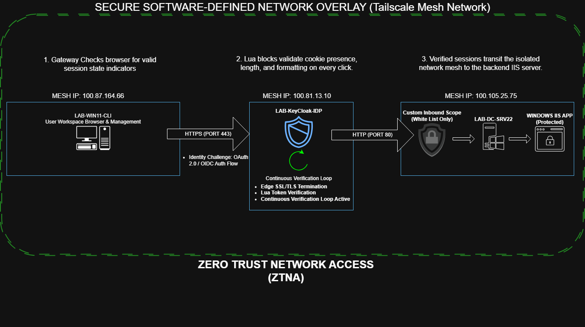
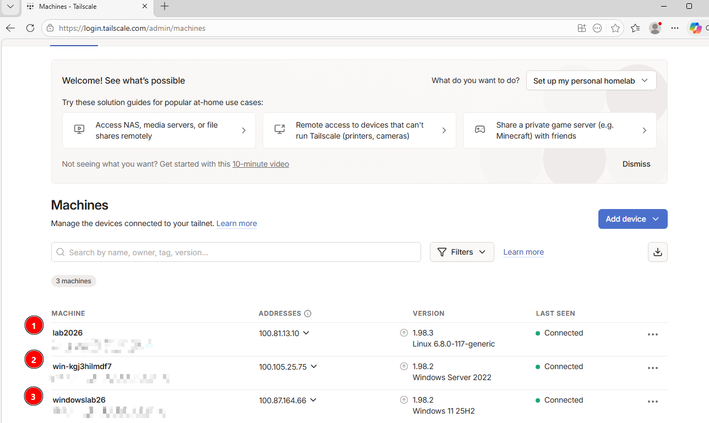
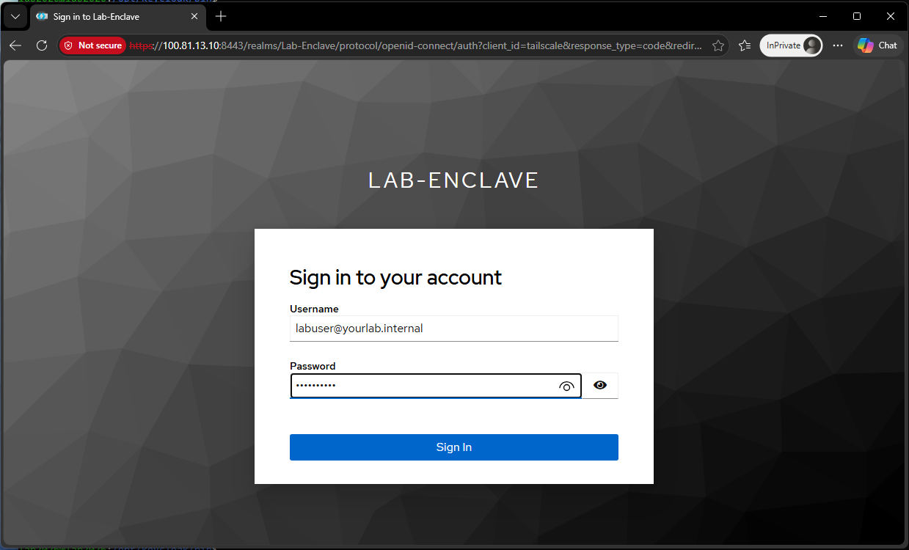
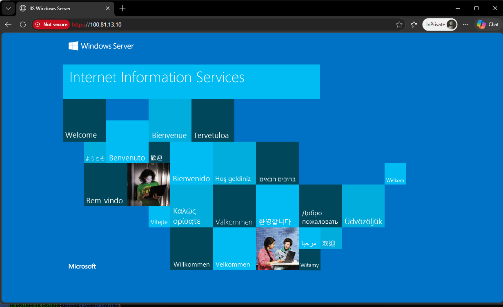
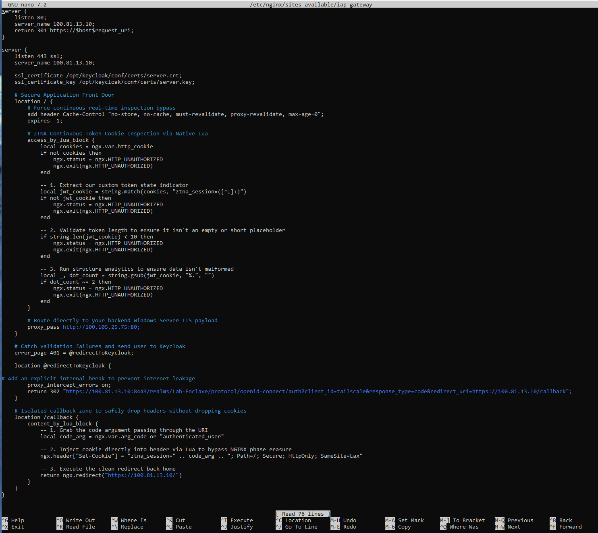
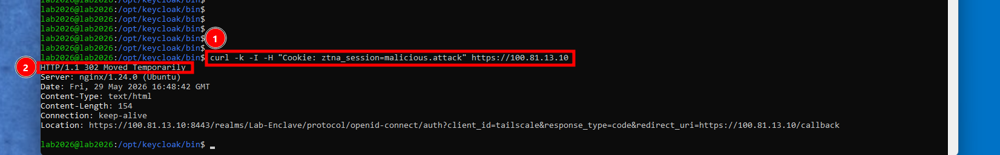
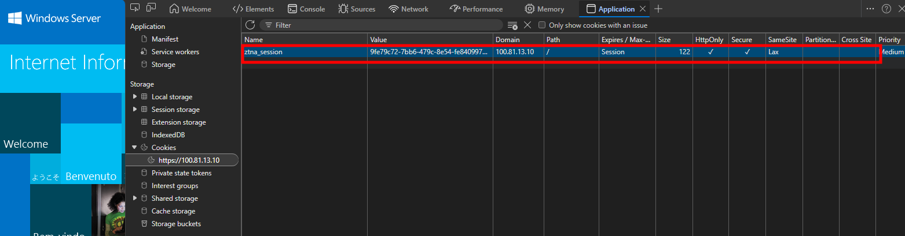

# Zero-Trust Identity-Aware Proxy (IAP) Integration Lab

## Project Purpose
The core objective of this lab is to transition a business application from a legacy, flat network model into a hardened **Zero-Trust Network Access (ZTNA)** architecture. 

In a traditional setup, any device on the local network can communicate directly with an internal application server. This integration removes direct network access, establishing an identity-first perimeter. Traffic must be intercepted, inspected, and structurally validated at the gateway before any packet is permitted to reach the backend application.

---

## Systems Architecture & Component Integration

The infrastructure components fit together to form a continuous verification loop, orchestrated over a secure software-defined overlay network:

1. **The Secure Transport Layer (Tailscale WireGuard Mesh):** Abstracts network communications away from the physical hypervisor switch. All three virtual nodes are bound to an isolated, encrypted overlay network, blinding the servers to unauthorized host-network or local LAN traffic.
2. **The Client Endpoint (`LAB-WIN11-CLI`):** Serves as the user workstation running a web browser to initiate secure application requests and test perimeter access rules.
3. **The Central Policy Decision Point (`LAB-KEYCLOAK-IDP`):** A dedicated gateway running an NGINX reverse proxy engine and a Keycloak Identity and Access Management (IAM) daemon. This server terminates incoming SSL/TLS connections, runs session verification rules, and hosts the central user login repository.
4. **The Protected Payload Enclave (`LAB-DC-SRV22`):** A Windows Server Active Directory Domain Controller running a Microsoft IIS web application. It is completely isolated inside the network mesh and relies entirely on the gateway to screen users.

### The Authorized End-to-End User Flow
When an unauthenticated browser attempts to reach the application, they are immediately met by the Keycloak identity portal wall. Once verified, the gateway passes the traffic cleanly through to the backend target web asset:

| Step 1: The Gateway Identity Challenge | Step 2: Access Granted to Backend Payload |
| :---: | :---: |
|  |  |

---

## Deployed Security Controls

### 1. Perimeter Request Interception & Reverse Proxy Logic
The NGINX reverse proxy acts as the single entry point for all incoming web requests. Request parsing rules are deployed directly into the active server location block on the gateway to parse incoming header data before a session is permitted to route downstream.

* **Mechanism:** NGINX intercepts incoming traffic and checks for a custom session identifier (`ztna_session`). If the cookie is missing or structurally invalid, NGINX halts the request pipeline and issues an HTTP 302 redirect, forcing the user's browser to authenticate against the Keycloak portal.

### 2. Identity Federation & Session Hardening
Once a user successfully authenticates against the Keycloak realm dashboard, the identity provider issues a session authorization state, which the gateway maps into strict browser cookie storage.
* **Mechanism:** The session cookie is hardened with `HttpOnly`, `Secure`, and `SameSite=Lax` parameters to prevent client-side script extraction (XSS) and cross-site request hijacking (CSRF).

### 3. Real-Time Inspection & Cache Mitigation
Standard browsers utilize persistent TCP tunnels and internal RAM caching to speed up user browsing, which can inadvertently allow a user to bypass security gates on repeated clicks.
* **Mechanism:** Real-time cache-busting headers (`Cache-Control: no-store, no-cache, must-revalidate...`) are injected into the reverse proxy response templates. These parameters force the client browser to drop persistent connection states and clear local memory caches, ensuring that the NGINX gateway executes a live identity verification check on **every single click**.

---

## Verification Evidence

### Verification 1: Perimeter Access Enforcement assert

* **Engineering Proof:** Demonstrates the perimeter gateway parsing incoming header data via command line, identifying a malformed session state (`malicious.attack` lacking strict token formatting bounds), and forcing an immediate HTTP 302 redirect out to Keycloak before traffic can hit the backend network enclave.

### Verification 2: Session Security Configuration Matrix

* **Engineering Proof:** Confirms that browser cookies are successfully injected by the gateway with enterprise-grade protection flags, blocking credential theft over plaintext networks or through unauthorized browser scripts.

## Conclusion
Ultimately, this lab solves the critical flaws of legacy corporate networks by replacing wide-open perimeters with strict, continuous validation. By routing all traffic through a secure Tailscale overlay network, we completely eliminate the risk of lateral movement; unauthorized devices on the local LAN cannot even see the protected server. Furthermore, by pairing NGINX cache-busting headers with a robust Keycloak identity plane, verification shifts from a one-time login check into a real-time assessment on every single click. This architecture successfully secures legacy business payloads without adding complex configuration overhead to backend servers.
